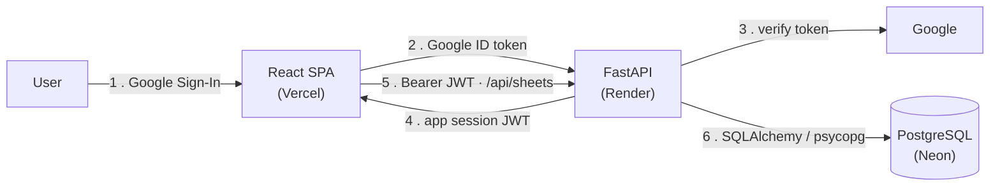

# ☕ Latte

A morning‑coffee‑themed productivity app. Sign in with Google and keep your
**to‑do lists**, **bucket lists**, and **weekly timetables** in one place, synced
to the cloud and scoped to your account.

| | |
|---|---|
| **Frontend** | <https://latte-plum.vercel.app> |
| **API** | <https://latte-api.onrender.com> · [`/docs`](https://latte-api.onrender.com/docs) |
| **Repository** | <https://github.com/ArmouredOre/Latte> |

---

## Table of contents

- [Overview](#overview)
- [Tech stack](#tech-stack)
- [Architecture](#architecture)
- [Features](#features)
- [Project structure](#project-structure)
- [API reference](#api-reference)
- [Data model](#data-model)
- [Local development](#local-development)
- [Environment variables](#environment-variables)
- [Deployment](#deployment)
- [Security](#security)
- [Limitations & roadmap](#limitations--roadmap)

---

## Overview

Latte started as a client‑only React prototype that stored everything in
`localStorage`. It is now a full **single‑page app + REST API + database**:

- **Google Sign‑In** (Google Identity Services) authenticates the user; the API
  verifies the Google ID token and issues its own short‑lived session JWT.
- Every list ("sheet") is owned by a user and persisted in **PostgreSQL**.
- The UI is optimistic and **auto‑saves** edits; a new list stays local until you
  actually put something in it, so mis‑clicks don't create empty records.

Three list types, each with its own columns and status workflow:

| Type | Columns | Status cycle |
|------|---------|--------------|
| **To‑Do** | Task · Due Date · Due Time · Status | Pending → In Progress → Completed |
| **Bucket** | Item · Category · Status | Not Started → In Progress → Done |
| **Timetable** | Subject · Day · Start · End · Status | Upcoming → Ongoing → Done |

---

## Tech stack

### Frontend

| Concern | Choice |
|---|---|
| Framework | **React 19** (function components + hooks, no router — views are state‑driven) |
| Build tool | **Vite 8** (`@vitejs/plugin-react`) |
| Styling | Hand‑written CSS (`src/App.css`), coffee palette, no UI library |
| Auth widget | **Google Identity Services** (`accounts.google.com/gsi/client`) |
| HTTP | `fetch`, wrapped in a small typed client (`src/api.js`) |
| Lint | **ESLint 9** flat config (`eslint.config.js`) + react‑hooks / react‑refresh plugins |
| State persistence | `localStorage` holds only the session JWT + cached profile |

### Backend

| Concern | Choice |
|---|---|
| Language | **Python 3.12** |
| Framework | **FastAPI 0.118** on **Uvicorn** |
| ORM | **SQLAlchemy 2.0** (`DeclarativeBase`, typed `Mapped[...]` columns) |
| Validation / config | **Pydantic 2** + **pydantic‑settings** |
| Auth | **google‑auth** (ID‑token verification) · **PyJWT** (HS256 session tokens) |
| DB driver | **psycopg 3** (PostgreSQL) · built‑in `sqlite3` for local dev |
| Schema management | `Base.metadata.create_all` on startup (no migration tool yet) |

### Infrastructure

| Layer | Service | Plan |
|---|---|---|
| Frontend hosting | **Vercel** | Hobby (free) |
| API hosting | **Render** | Free web service (`render.yaml` blueprint) |
| Database | **Neon** — serverless PostgreSQL | Free tier, pooled connection |
| OAuth | **Google Cloud** OAuth 2.0 Web client | — |
| Source / CI | **GitHub** → auto‑deploy on push to `main` (both Vercel and Render) |

---

## Architecture



1. The browser gets a Google **ID token** from the sign‑in button.
2. It's POSTed to `/api/auth/google`.
3. The API verifies signature, audience (`GOOGLE_CLIENT_ID`), issuer and
   `email_verified` with `google-auth`.
4. The API upserts the user and returns its **own JWT** (`sub` = Google user id,
   7‑day expiry, HS256). The SPA stores it in `localStorage`.
5. Every subsequent request carries `Authorization: Bearer <jwt>`; a dependency
   decodes it and loads the `User`.
6. All list data lives in PostgreSQL; each query is filtered by `owner_id`.

CORS is an explicit allow‑list (`CORS_ORIGINS`), so only the known frontend
origins may call the API from a browser.

---

## Features

- **Google Sign‑In** with a persistent session (survives refresh); one‑click
  logout that also clears Google's auto‑select.
- **Per‑user isolation** — you only ever see and modify your own sheets;
  cross‑user access returns `404`.
- **Three list types** with per‑type columns, placeholders, and a click‑to‑cycle
  status badge.
- **Draft‑first creation** — a new list is in‑memory only (`id: null`) with one
  starter row; it's persisted on the first real edit or manual save, and
  discarded silently if you back out without touching it.
- **Debounced auto‑save** (~1.2 s after the last edit) plus a manual **Save**
  button that doubles as a status indicator.
- **Click‑to‑rename** sheet titles.
- **Unsaved‑changes guard** when navigating away mid‑edit.
- Collapsible sidebar grouped by list type, with an "unsaved" dot per sheet.
- Auto‑dismissing error banner; `401` anywhere signs you out cleanly.

---

## Project structure

```
.
├── index.html                 # loads the GIS script + the SPA
├── vite.config.js             # base '/' (Vercel) | '/Latte/' when GH_PAGES=1
├── eslint.config.js
├── render.yaml                # Render blueprint for the API service
├── DEPLOY.md                  # step-by-step Neon + Render + Vercel runbook
├── src/
│   ├── main.jsx               # React entry
│   ├── App.jsx                # App, LoginScreen, SheetView, ListLanding, NewSheetModal
│   ├── api.js                 # session + typed API client (fetch wrapper)
│   ├── App.css                # all app styles
│   └── index.css
└── backend/
    ├── requirements.txt
    ├── .python-version        # 3.12.5
    ├── .env.example
    └── app/
        ├── main.py            # FastAPI app, CORS, body-size middleware, lifespan
        ├── config.py          # pydantic-settings; DB URL normalization
        ├── database.py        # engine, SessionLocal, get_db dependency
        ├── models.py          # User, Sheet, ListType
        ├── schemas.py         # request/response models + input limits
        ├── auth.py            # Google verify, JWT issue/verify, get_current_user
        ├── crud.py            # DB operations (ownership-checked)
        └── routers/
            ├── auth.py        # POST /api/auth/google
            └── sheets.py      # /api/sheets CRUD
```

---

## API reference

Base URL: `https://latte-api.onrender.com` · interactive docs at `/docs`.

| Method | Path | Auth | Body | Notes |
|---|---|:--:|---|---|
| `GET` | `/api/health` | – | – | Liveness probe |
| `POST` | `/api/auth/google` | – | `{ credential }` | Google ID token → `{ access_token, token_type, user }` |
| `GET` | `/api/sheets` | ✔ | – | `?list_type=todo\|bucket\|timetable` optional filter |
| `POST` | `/api/sheets` | ✔ | `{ name, list_type, rows? }` | `201` with the created sheet |
| `GET` | `/api/sheets/{id}` | ✔ | – | `404` if not owned |
| `PUT` | `/api/sheets/{id}` | ✔ | `{ name?, rows? }` | `400` if both omitted |
| `DELETE` | `/api/sheets/{id}` | ✔ | – | `204` |

Auth is `Authorization: Bearer <session JWT>`. Validation failures return `422`;
oversized payloads return `413`; expired/invalid sessions return `401`.

---

## Data model

```
User                              Sheet
────────────────────────          ──────────────────────────────────
id        TEXT  PK (Google sub)   id          INT   PK
email     TEXT  unique            owner_id    TEXT  FK → User.id
name      TEXT                    list_type   ENUM  todo|bucket|timetable
picture   TEXT  nullable          name        TEXT  (≤ 200 chars)
created_at TIMESTAMPTZ            rows        JSON  (list of row objects, ≤ 2000)
                                  created_at  TIMESTAMPTZ
                                  updated_at  TIMESTAMPTZ (auto on update)
```

`rows` is an opaque JSON array — the shape of each row is defined entirely by the
frontend's per‑type column config, so new list layouts need no schema change.
Tables are created automatically on API startup.

---

## Local development

**Prerequisites:** Node 20+, Python 3.12, a Google OAuth 2.0 Web client whose
*Authorized JavaScript origin* includes `http://localhost:5173`.

### Backend

```bash
cd backend
python -m venv .venv && source .venv/bin/activate
pip install -r requirements.txt
cp .env.example .env      # then fill in the values (see below)
uvicorn app.main:app --reload --port 8000
```

Defaults to a local SQLite file (`backend/latte.db`) — no database server needed.

### Frontend

```bash
npm install
cp .env.example .env.local   # set VITE_API_URL + VITE_GOOGLE_CLIENT_ID
npm run dev                   # http://localhost:5173
```

### Scripts

| Command | Purpose |
|---|---|
| `npm run dev` | Vite dev server |
| `npm run build` | Production build → `dist/` (base `/`) |
| `npm run preview` | Serve the built bundle locally |
| `npm run lint` | ESLint |
| `npm run deploy` | Build with `GH_PAGES=1` (base `/Latte/`) and publish to GitHub Pages |

---

## Environment variables

### Backend (`backend/.env` locally, Render dashboard in prod)

| Key | Example | Notes |
|---|---|---|
| `GOOGLE_CLIENT_ID` | `…apps.googleusercontent.com` | Must match the frontend's client ID |
| `JWT_SECRET` | 48‑byte random string | Signs session tokens; Render auto‑generates it |
| `DATABASE_URL` | `sqlite:///./latte.db` / `postgres://…` | `postgres://` & `postgresql://` are auto‑upgraded to the psycopg driver |
| `CORS_ORIGINS` | `https://latte-plum.vercel.app,http://localhost:5173` | Comma‑separated allow‑list |

### Frontend (`.env.local` locally, Vercel env in prod — all `VITE_`‑prefixed, baked in at build time)

| Key | Example |
|---|---|
| `VITE_API_URL` | `https://latte-api.onrender.com` |
| `VITE_GOOGLE_CLIENT_ID` | `…apps.googleusercontent.com` |

---

## Deployment

Full runbook in **[DEPLOY.md](DEPLOY.md)**. In short:

1. **Neon** — create a project, copy the **pooled** connection string.
2. **Render** — *New → Blueprint* on this repo; `render.yaml` provisions the free
   web service. Set `DATABASE_URL`, `GOOGLE_CLIENT_ID`, `CORS_ORIGINS`
   (`JWT_SECRET` is generated).
3. **Vercel** — set `VITE_API_URL` + `VITE_GOOGLE_CLIENT_ID`, then redeploy so
   Vite rebuilds with them.
4. **Google Cloud** — add the Vercel origin to the OAuth client's *Authorized
   JavaScript origins*.

Both Vercel and Render redeploy automatically on push to `main`.

---

## Security

A pre‑deployment review covered the backend; SQL injection, IDOR, token forgery,
mass assignment, and CORS all came back clean. Findings that were fixed:

- **Input limits** — `name` ≤ 200 chars, `rows` ≤ 2000 entries, request body
  ≤ 2 MiB (middleware rejects before reading the body).
- **Bounded path params** — `sheet_id` constrained to a positive 32‑bit range,
  so an out‑of‑range id is a `422` instead of an unhandled `500`.
- **No error leakage** — Google‑auth failures return a fixed message; the real
  reason is logged server‑side.

Baked‑in protections: ORM‑parameterized queries only, per‑request ownership
checks on every sheet route, explicit `algorithms=["HS256"]` on JWT decode,
explicit Pydantic schemas (no mass assignment), and a CORS allow‑list.

---

## Limitations & roadmap

- **Free‑tier cold starts** — Render sleeps after 15 min idle and Neon after
  5 min; the first request after a quiet spell can take ~1 minute.
- **Neon free DB** never expires, but Render's own free Postgres would — hence
  the external database.
- **No rate limiting** yet on `/api/auth/google` or `POST /api/sheets`.
- **Session tokens** are 7‑day JWTs with no server‑side revocation.
- **`/docs` / `/openapi.json`** are publicly reachable in production.
- **No automated test suite** yet.
- **No migration tool** — schema changes rely on `create_all`; adding Alembic is
  the next step before any breaking model change.
